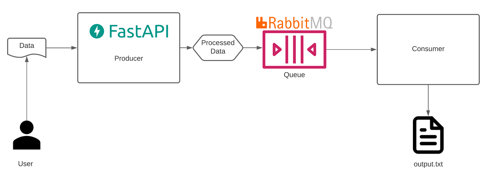

# consumer-producer-service

A Producer and a Consumer service that will be connected through a Queue



## Producer
- API exposed via HTTP
- Receives data in JSON format
- Puts the JSON it received in the queue

Build with `FastAPI` and `aio_pika`

## Consumer
- Listens to the queue
- Appends the records to an output.txt file

Built with `pika`

## Development

If using vscode, a `devcontainer` configuration for local development is available.

The app uses `flake8` for code linting and `mypy` for type checking, and uses `pytest` to run unit and integration tests.

## Usage

The `Makefile` contains the commands to run the app.

Use the `env.example` to configure the environment variables in `.env`.

After configuring the `.env` file, start the app by running `make start-app`.
This will pull the images, build then start the containers.

After it is complete, access `http://localhost:8000/docs` to see the swagger documentation of the producer api.
You can also check the logs by running `make logs-app`.

Use the endpoint `/process` to send a message to the queue.
If it returns `success`, the message was put in the queue successfully.
If the logs were opened, you will be able to see something like the following:
```log
producer_1  | 2021-06-13 17:39:34.569 | INFO     | main.py:90 @process - Sent {'hello': 'world'} to queue default
...
consumer_1  | 2021-06-13 17:39:34.564 | INFO     | main.py:37 @callback -  [✓] Received b'{"hello": "world"}' on queue default
```

Now, check the file `output.txt`, in the same folder as the `docker-compose.yml` to see the message added to the end of the file.
